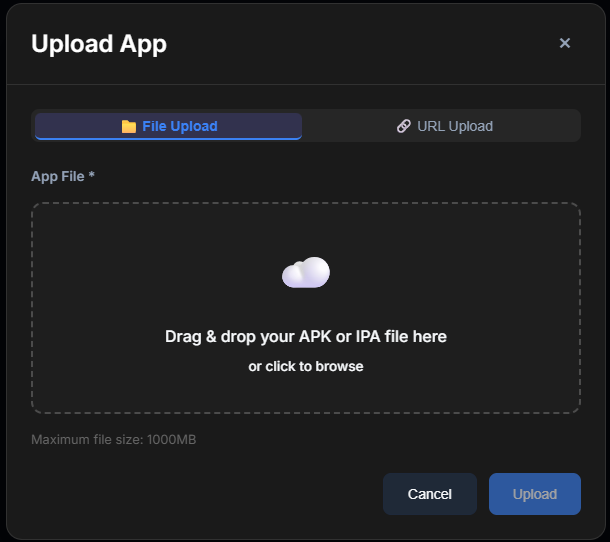

# Uploading Apps (Android vs iOS)

To run autonomous mobile tests with Rova, you first need to give the AI agent access to your mobile application.

To open the uploader, simply navigate to the Apps page in your dashboard and click the Upload App button.

### Upload Methods

Rova offers two simple ways to get your app binary into the cloud environment:

#### 1. File Upload (Direct Drag & Drop)

If you have the build file sitting on your computer, this is the quickest way to get started.

* Supported Formats: `.apk` (Android) or `.ipa` (iOS) files.
* Size Limit: You can upload builds up to 1000MB (1GB).
* How to use: Drag and drop your file directly into the modal or click to browse your local folders.

<figure><figcaption></figcaption></figure>

#### 2. URL Upload (Direct Link)

If your app is built automatically through a CI/CD pipeline, you can bypass downloading it locally by pointing Rova to a hosted file.

* Platform Selection: Explicitly select whether the URL points to an Android or iOS binary.
* App URL: Provide a direct, publicly accessible download link to your app (e.g., from your GitHub releases, AWS S3 buckets, Bitrise artifacts, or other CI/CD storage).
* _Note: Ensure the link is a direct download link and does not require authentication or passcodes to access._

<figure><figcaption></figcaption></figure>

### Platform Requirements: Android vs. iOS

To ensure your tests run smoothly on Rova's cloud-hosted devices, make sure your build files match these specifications:

#### Android (`.apk`)

* Format: Upload a standard `.apk` build file.
* Build Type: We highly recommend uploading a Debug build (or a release build that has debugging symbols/accessibility labels enabled). This makes it easier for Rova's AI to interact with and understand your app's element hierarchy.

#### iOS (`.ipa`)

* Format: Upload a packaged `.ipa` build file.
* Signing: Ensure your `.ipa` is signed with an appropriate provisioning profile (such as an Ad-Hoc or Enterprise distribution profile) that allows it to run on virtual or real mobile devices in a cloud environment.

### Best Practices

* Keep Accessibility Labels Intact: Rova's AI performs best when you use native UI components with clear accessibility identifiers (like `accessibilityIdentifier` in iOS and `contentDescription` in Android).
* Automate with URL Uploads: Instead of manually uploading a new build every time your team writes code, set up your CI/CD tool to ping Rova's API keys with the latest build URL.
