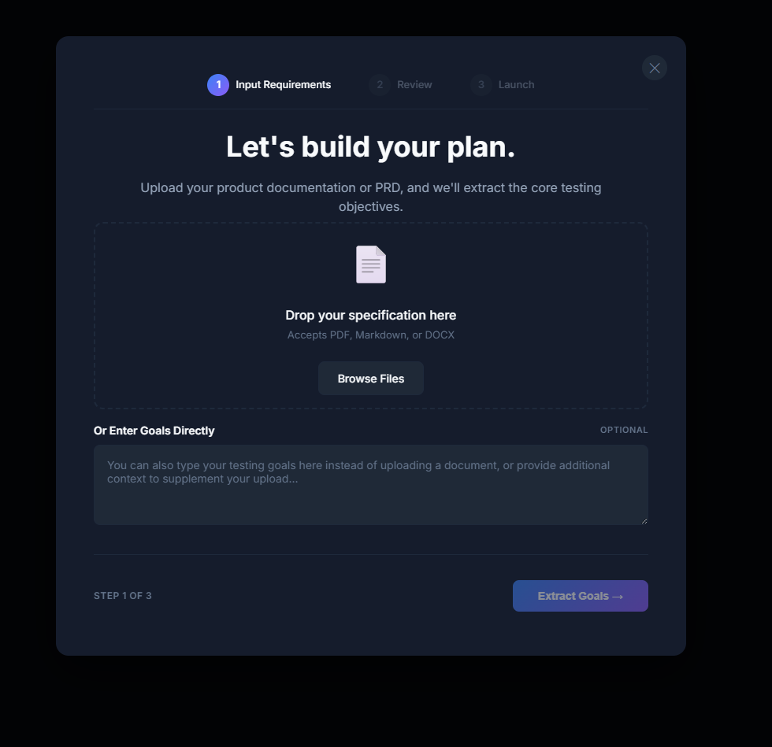

# Execution Plans

Testing a single flow is great, but real-world apps require testing multiple connected journeys. Execution Plans allow you to run multi-goal mobile test executions that share context and harness AI-powered autonomy to test your app comprehensively.

### What is an Execution Plan?

Instead of running isolated tests, an Execution Plan lets you run a sequence of multiple test goals in a single, continuous session.

### Key Features

* Upload Documents: Easily import your product requirements documents (PRDs), feature specs, or user stories (accepting PDF, DOCX, Markdown, or TXT files). Rova's AI parses these files to automatically extract and generate mobile test goals.
* AI Extraction: Our AI detects test goals directly from your uploaded specs, automatically assigning priority, estimated complexity, and duration to each test run.
* Shared Context: Goals in a plan share the same device session. This means the AI agent won't waste time executing redundant logins, re-registering accounts, or repeating deep-link navigations between test cases.
* Real-Time Monitoring: Watch your tests run live on virtual mobile devices with real-time insights, progress tracking, and full automated screen recordings of the execution.

### Creating an Execution Plan

Setting up a plan takes just three simple steps:

<figure><figcaption></figcaption></figure>

#### Step 1: Input Requirements

You can feed testing goals to Rova in two ways:

* Upload a Specification: Drag and drop your PRD or mobile feature spec (PDF, DOCX, Markdown, or TXT).
* Enter Goals Directly: If you don’t have a document handy, you can type your testing goals directly into the text area, or use it to add extra context to your file upload.

Once your inputs are ready, tap Extract Goals to let the AI process your requirements.

#### Step 2: Review

Rova will present a list of extracted mobile test goals. Here, you can review the AI-suggested priorities, adjust the order of operations, and refine the goals before launching.

#### Step 3: Launch

Once confirmed, kick off the execution. Rova will spin up the virtual device environment, install your app, and run through the entire plan in a single, smart session.
